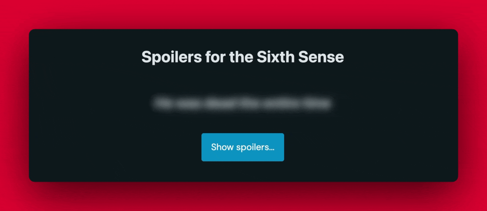

# <no-spoilers>

A progressively-enhanced spoiler tag that works without JavaScript.



## Installation

```bash
npm i no-spoilers
```

## Usage

```html
<script type="module">
  import "no-spoilers/no-spoilers.js";
</script>

<no-spoilers>
  <details>
    <p>This is a spoiler</p>
  </details>
</no-spoilers>
```

Note: The `details` tag is optional but ensures that if the web component fails to load that the spoiler won't be revealed by default. `no-spoilers` checks to see if a single details element is the only child and if so, it will rmeove the `details` element and replace it with the `details`'s children.


### Attributes

- `button-text` - Displays the text on the button that reveals the spoiler. Default: "Reveal Spoiler"
